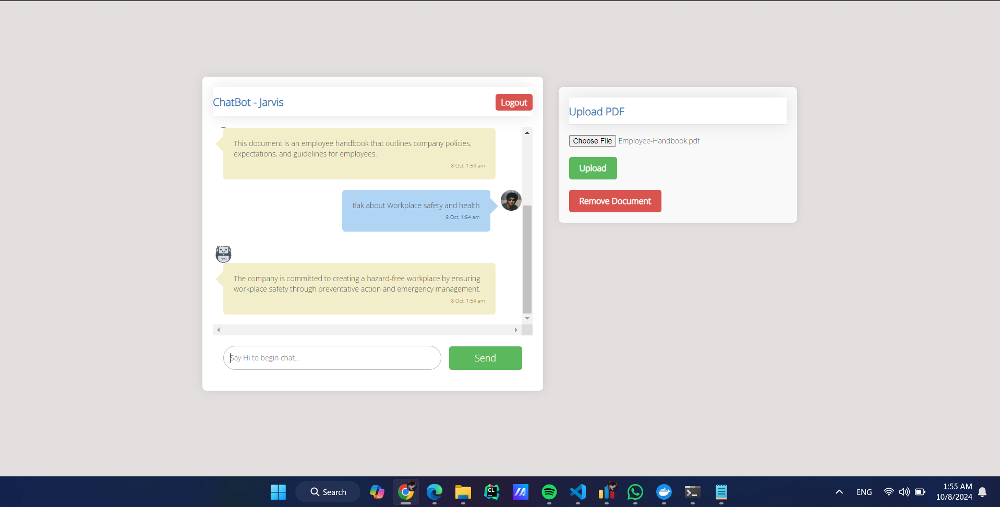

# RAG-based Chatbot with Flask and Google Generative AI

This project implements a chatbot capable of answering questions based on uploaded PDFs using Retrieval-Augmented Generation (RAG). It leverages **Flask** for the web interface and **Google Generative AI** for question-answering. The app also includes user authentication (registration and login) and file upload features.



## Features

- **PDF Upload**: Users can upload PDF files.
- **RAG-based Q&A**: A chatbot that answers questions by extracting relevant information from the uploaded PDF.
- **User Authentication**: Secure user registration and login functionality.
- **Vector Store**: Stores document embeddings for fast retrieval of relevant sections during question answering.
- **Caching**: Implements an LRU cache for optimizing responses to repeated user questions.

## Technology Stack

- **Backend**: Flask, SQLAlchemy, and Flask-Login for user management.
- **AI Services**: LangChain and Google Generative AI for embedding and question-answering.
- **PDF Processing**: PyPDF2 for extracting text from PDFs.
- **Vector Database**: FAISS (Facebook AI Similarity Search) for managing vectorized document chunks.
- **Frontend**: Flask-WTF for form management (login/registration), HTML for web pages.
- **Docker**: The project is containerized using Docker and Docker Compose for easy setup and deployment.

## Installation

1. **Clone the repository**:
   ```bash
   git clone https://github.com/Samspei01/RAG-based-Chatbot-with-Flask-and-Google-Generative-AI.git
   cd RAG-based-Chatbot-with-Flask-and-Google-Generative-AI
   ```

2. **Set up a virtual environment**:
   ```bash
   python3 -m venv venv
   source venv/bin/activate
   ```

3. **Install the required dependencies**:
   ```bash
   pip install -r requirements.txt
   ```

4. **Set up environment variables**:
   Create a `.env` file in the root directory with the following environment variable:
   ```bash
   GOOGLE_API_KEY=your_google_api_key
   ```

5. **Initialize the database**:
   ```bash
   flask db init
   flask db migrate
   flask db upgrade
   ```

6. **Run the application**:
   ```bash
   flask run
   ```

## Running with Docker

Build and run Docker containers:
```bash
docker-compose up --build
```
The application will be available at `http://localhost:5000`.

## Project Structure

```
├── app.py                      # Main Flask app
├── RAG.py                      # RAG chatbot logic
├── pform.py                    # Flask-WTF forms for registration and login
├── Dockerfile                  # Docker configuration for the app
├── docker-compose.yml          # Docker Compose setup
├── requirements.txt            # Project dependencies
├── static/                     # Static files (CSS, JS, images)
├── templates/                  # HTML templates for Flask
├── uploads/                    # Directory to store uploaded PDFs
└── .env                        # Environment variables
```

## Usage

### User Registration/Login:
- Visit the `/register` page to create an account.
- Use the `/login` page to log into the system.

### Uploading PDFs:
- After logging in, upload a PDF file using the `/upload` endpoint.

### Chatbot:
- Once the PDF is uploaded, navigate to `/chatbot` to ask questions related to the uploaded document.

## Environment Variables

- **GOOGLE_API_KEY**: API key for accessing Google Generative AI services.
